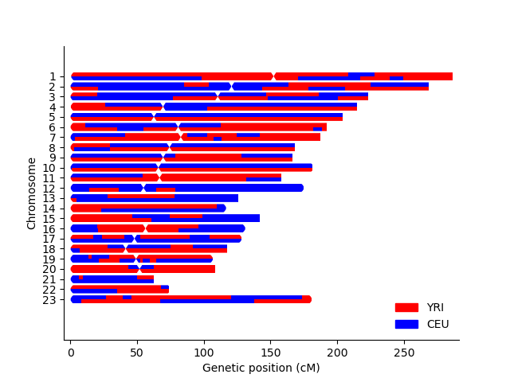

.. _commands-karyogram:

karyogram
=========

Takes as input a breakpoints file (e.g. as output by :doc:`simgenotype </commands/simgenotype>`) and a sample name, and plots a karyogram depicting local ancestry tracks.

Basic Usage
~~~~~~~~~~~
.. code-block:: bash

  haptools karyogram \
  --bp BREAKPOINTS \
  --sample SAMPLE \
  --out PNG
  
See details of the breakpoints file :doc:`here </formats/breakpoints>`. If you specify ``--sample $SAMPLE``, the breakpoints file must have breakpoints for ``$SAMPLE_1`` and ``$SAMPLE_2`` (the two haplotypes of ``$SAMPLE``).

Additional Options
~~~~~~~~~~~~~~~~~~
You may also specify the following options:

* ``--centromeres <FILE>``: Path to a file describing the locations of chromosome ends and centromeres. An example file is given here: ``tests/data/centromeres_hg19.txt``. The columns are: chromosome, chrom_start, centromere, chrom_end. For acrocentric chromosomes, the centromere field is ommitted. This file format was taken from `here <https://github.com/armartin/ancestry_pipeline>`_.
* ``--colors "pop1:color1,pop2:color2..."``: You can optionally specify which colors should be used for each population. If colors are not given, the script chooses reasonable defaults.
* ``--title <TITLE>``: Title for the resulting karyogram.

Example
~~~~~~~

.. code-block:: bash

   haptools karyogram \
   --bp tests/data/5gen.bp \
   --sample Sample_1 \
   --out test_karyogram.png \
   --centromeres tests/data/centromeres_hg19.txt \
   --title "5 Generation Karyogram" \
   --colors 'CEU:blue,YRI:red'

This will output a file ``test_karyogram.png``. The example is shown below.

Detailed Usage
~~~~~~~~~~~~~~

.. click:: haptools.__main__:main
   :prog: haptools
   :nested: full
   :commands: karyogram
